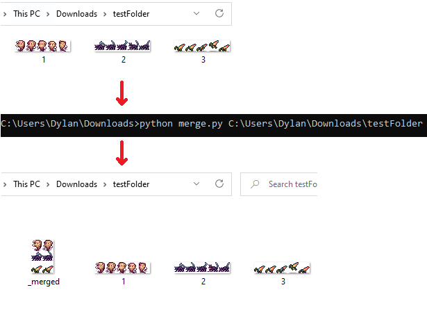

# Image Crop and Merge Tool
 
A light command line tool built in Python to crop out specific parts of spritesheets and then merge them into a new image file. Great for when there are more animation frames than you need for a specific asset and you quickly want to get X animations from each asset.

## Dependencies

- Have Python 3.9 or higher installed
- Have Pillow (PIL) installed (_python3 -m pip install --upgrade pip_)

## Usage

Open up your command line and type: 
**python merge.py [path]** 

(where **[path]** is a proper OS path of the folder of images to merge)

## Example

In this example, I only want the first two sprites in each spritesheet, and I want them stacked vertically. I could opt to have multiple columns, or the first three sprites of each sheet, etc. These are all configurable in the "variables" section.

